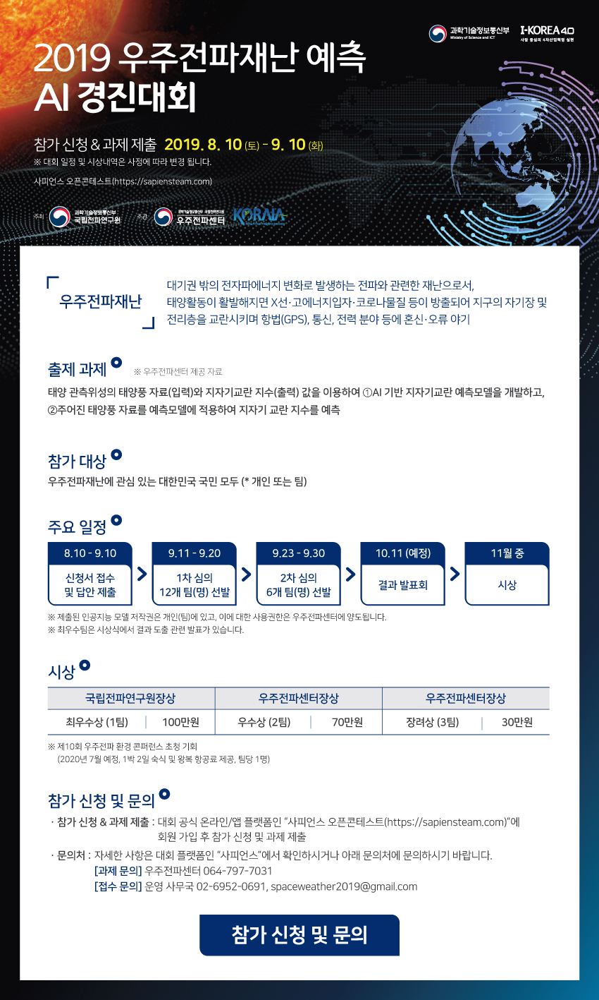

# CosmicRadioWaveDisaster
AI competition to predict cosmic radio waves disaster

Informations of competition is on [here](https://sapiensteam.com/make/contestDetail.do?contestId=23)

This project was worked with 박현후, [신승헌](https://github.com/Seungheon-Shin)

We were helped by [this video](https://www.youtube.com/watch?v=javWSq-5xzw)

## Summary

### Dataset
* Since more than half of the data is missing, the N-p value was not used.
* We predicted kp values using previous values(since 3-hours ago)

### Code
* These codes were built on Windows10 enviroment(python_3.6, pytorch_0.4.1, pandas_0.24.1, scikit-learn_0.21.3)
* setting.py
    * We define classes and methods in this code
* main.py
    * This code preprocesses input data and apply training and testing
* applyModel.py
    * We apply trained model to competition data and get result
    
### Result
* 1st discussion: Weighted RMSE = 0.846646 (12/107 teams)
* 2nd discussion: Weighted RMSE = 1.920094 (14/16 teams)
